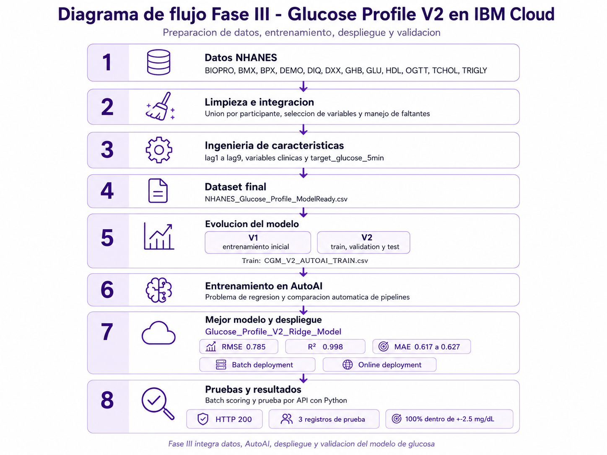

# Glucose Profile V2

Aplicación interactiva para simular una secuencia de glucosa y consultar un modelo de regresión desplegado en IBM Machine Learning.

El modelo estima la siguiente lectura de un sistema CGM, aproximadamente 5 minutos hacia el futuro, a partir de 24 lecturas históricas.



## Demo

La interfaz permite:

- Crear escenarios estables, ascendentes, descendentes o variables.
- Editar una secuencia personalizada de 24 lecturas.
- Visualizar dos horas de historial.
- Consultar el deployment online de IBM.
- Comparar la lectura actual contra la predicción a 5 minutos.

## Evolución

### V1

- Ridge Regression.
- StandardScaler.
- Ingeniería manual de 51 características.
- Validación agrupada por participante.

### V2

- Entrenamiento en IBM AutoAI.
- Comparación de 8 pipelines.
- División independiente por participantes.
- Batch deployment.
- Online deployment.
- Comprobación con Python y respuesta HTTP 200.

## Resultados

| Métrica | Resultado |
|---|---:|
| RMSE holdout | 0.785 |
| RMSE cross-validation | 0.814 |
| R² | 0.998 |
| MAE externo | 0.675 mg/dL |
| Dentro de 2.5 mg/dL | 99.39% |
| Validación cruzada de 10 grupos | 99.50% |

La validación externa utilizó 8,400 registros de 10 participantes no incluidos en el entrenamiento.

## Arquitectura

```text
Interfaz Streamlit
        |
Ingeniería de características en Python
        |
Autenticación IBM Cloud IAM
        |
IBM Machine Learning Online Deployment
        |
Predicción y visualización
```

## Seguridad

Las credenciales de IBM se administran como secretos privados del servidor.

- La API key no se almacena en GitHub.
- El endpoint no se muestra en la interfaz.
- El navegador no recibe la API key.
- Las solicitudes a IBM se realizan desde el backend de Streamlit.
- El repositorio excluye archivos locales de secretos.

## Tecnologías

- Python
- pandas
- NumPy
- Plotly
- Streamlit
- IBM AutoAI
- IBM Machine Learning
- IBM Cloud IAM
- REST API

## Estructura

```text
app.py
glucose_features.py
ibm_client.py
simulations.py
scripts/validate_endpoint.py
data/sample_features.csv
assets/
docs/
```

## Limitaciones

El proyecto es académico y experimental.

No está diseñado para:

- Diagnosticar diabetes.
- Sustituir una medición clínica.
- Calcular dosis de insulina.
- Recomendar tratamientos.
- Tomar decisiones médicas.

Se observaron dos errores extremos durante la validación externa. El desempeño también disminuyó durante cambios rápidos de glucosa.
